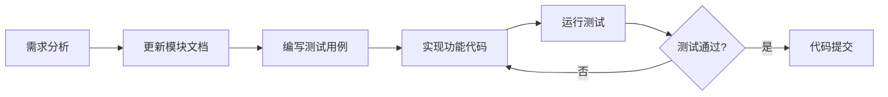

# MobausStudio 开发指南

## 📋 目录

1. [开发环境配置](#开发环境配置)
2. [项目结构说明](#项目结构说明)
3. [开发工作流](#开发工作流)
4. [代码规范](#代码规范)
5. [测试规范](#测试规范)
6. [Git提交规范](#git提交规范)

---

## 开发环境配置

### 前置要求

- **Node.js**: 18.0+
- **Rust**: 1.70+
- **操作系统**: macOS 10.15+, Windows 10+, Linux

### 安装步骤

```bash
# 1. 克隆项目
git clone <repository-url>
cd MobausStudio

# 2. 安装前端依赖
npm install

# 3. 安装Rust依赖（首次运行时自动安装）
npm run tauri dev
```

### 开发命令

| 命令 | 说明 |
|------|------|
| `npm run dev` | 启动Vite开发服务器（仅前端） |
| `npm run tauri dev` | 启动Tauri开发模式（全栈） |
| `npm run build` | 构建前端 |
| `npm run tauri build` | 构建桌面应用 |
| `npm run test` | 运行前端测试 |
| `npm run test:rust` | 运行Rust测试 |

---

## 项目结构说明

### 前端 (`src/`)

```
src/
├── components/         # React 组件
│   ├── common/        # 通用组件
│   └── features/      # 功能组件
├── hooks/             # 自定义 React Hooks
├── services/          # API 服务层
├── stores/            # 状态管理
├── types/             # TypeScript 类型定义
├── utils/             # 工具函数
├── test/              # 测试配置
├── App.tsx            # 主组件
└── main.tsx           # 入口文件
```

### 后端 (`src-tauri/`)

```
src-tauri/
├── src/
│   ├── main.rs        # 主入口
│   ├── lib.rs         # 库入口（Tauri命令）
│   ├── commands/      # Tauri命令模块
│   └── services/      # 业务逻辑服务
├── Cargo.toml         # Rust依赖配置
└── tauri.conf.json    # Tauri配置
```

---

## 开发工作流

### 核心原则

> ⚠️ **重要**: 遵循「先文档后代码」原则

1. **理解需求** - 明确功能目标和边界
2. **更新文档** - 在 `docs/modules/` 创建或更新模块文档
3. **编写测试** - TDD方式，先写测试用例
4. **实现功能** - 编写最小化代码实现功能，避免重复造轮子，写代码之前先检查是否可以复用逻辑
5. **运行测试** - 确保所有测试通过
6. **代码审查** - 提交PR进行review
7. **注释和日志** - 代码中必须有详细中文注释和日志
8. **依赖库** - 尽量使用成熟稳定依赖库


### 模块开发流程



---

## 代码规范

### TypeScript/React 规范

- 使用 TypeScript 严格模式
- 组件使用函数式组件 + Hooks
- Props 必须定义接口类型
- 避免使用 `any` 类型

```typescript
// ✅ 推荐
interface ButtonProps {
  label: string;
  onClick: () => void;
  disabled?: boolean;
}

export const Button: React.FC<ButtonProps> = ({ label, onClick, disabled = false }) => {
  return (
    <button onClick={onClick} disabled={disabled}>
      {label}
    </button>
  );
};

// ❌ 避免
export const Button = (props: any) => { ... };
```

### Rust 规范

- 遵循 Rust 官方风格指南
- 使用 `cargo fmt` 格式化代码
- 使用 `cargo clippy` 检查代码质量
- 公共接口必须添加文档注释

```rust
/// 调用AI模型获取回复
/// 
/// # Arguments
/// * `prompt` - 用户输入的提示词
/// 
/// # Returns
/// AI模型生成的回复内容
#[tauri::command]
pub async fn chat(prompt: String) -> Result<String, String> {
    // 实现逻辑
}
```

---

## 测试规范

### 前端测试

使用 **Vitest** 作为测试框架：

```typescript
// src/components/Button.test.tsx
import { describe, it, expect, vi } from 'vitest';
import { render, fireEvent } from '@testing-library/react';
import { Button } from './Button';

describe('Button', () => {
  it('should render with label', () => {
    const { getByText } = render(<Button label="Click me" onClick={() => {}} />);
    expect(getByText('Click me')).toBeDefined();
  });

  it('should call onClick when clicked', () => {
    const handleClick = vi.fn();
    const { getByText } = render(<Button label="Click" onClick={handleClick} />);
    fireEvent.click(getByText('Click'));
    expect(handleClick).toHaveBeenCalled();
  });
});
```

### Rust 测试

使用内置测试框架：

```rust
#[cfg(test)]
mod tests {
    use super::*;

    #[test]
    fn test_chat_function() {
        // 测试实现
    }

    #[tokio::test]
    async fn test_async_function() {
        // 异步测试实现
    }
}
```

---

## Git提交规范

使用 [Conventional Commits](https://www.conventionalcommits.org/) 规范：

### 提交格式

```
<type>(<scope>): <description>

[optional body]

[optional footer]
```

### 类型说明

| 类型 | 说明 |
|------|------|
| `feat` | 新功能 |
| `fix` | Bug修复 |
| `docs` | 文档更新 |
| `style` | 代码格式调整（不影响功能） |
| `refactor` | 重构 |
| `test` | 测试相关 |
| `chore` | 构建/工具相关 |

### 示例

```
feat(chat): 添加AI对话功能

- 实现与AI模型的基础对话
- 添加消息历史记录
- 支持流式响应

Closes #123
```
