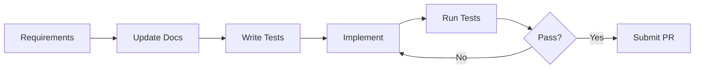
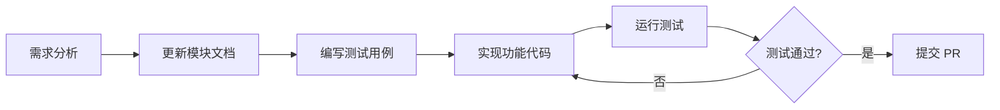

# MobausStudio Development Guide / 开发指南

> [English](#english) | [中文](#中文)

---

<a id="english"></a>

## English

### Development Environment

#### Prerequisites

- **Node.js**: 20+
- **Rust**: stable
- **OS**: macOS 10.15+, Windows 10+, Linux
- Platform dependencies: see [Tauri prerequisites](https://tauri.app/start/prerequisites/)

#### Setup

```bash
# 1. Clone the repository
git clone https://github.com/shulain/MobausStudio.git
cd MobausStudio

# 2. Install frontend dependencies
npm install

# 3. Start Tauri dev mode (Rust dependencies install automatically on first run)
npm run tauri dev
```

#### Commands

| Command | Description |
| ------- | ----------- |
| `npm run dev` | Start Vite dev server (frontend only) |
| `npm run tauri dev` | Start Tauri dev mode (full stack) |
| `npm run build` | Build frontend |
| `npm run tauri build` | Build desktop app |
| `npm test` | Run frontend tests |
| `cd src-tauri && cargo test` | Run Rust tests |
| `npm run test:coverage` | Test coverage report |

---

### Project Structure

```text
MobausStudio/
├── src/                    # React frontend
│   ├── components/         # UI components
│   │   ├── common/         #   Shared components (Button, Modal, Toast, etc.)
│   │   ├── features/       #   Feature components (Chat, Agent, MCP, Skills, etc.)
│   │   └── layout/         #   Layout components (Header, Sidebar)
│   ├── hooks/              # Custom React Hooks
│   ├── services/           # Business logic (auth, providers, MCP, models)
│   ├── types/              # TypeScript type definitions
│   ├── utils/              # Utility functions
│   ├── i18n/               # Internationalization (en, zh)
│   ├── test/               # Test files
│   ├── App.tsx             # Root component
│   └── main.tsx            # Entry point
├── src-tauri/              # Rust backend
│   └── src/
│       ├── main.rs         # Entry point
│       ├── lib.rs          # Tauri commands & core logic
│       ├── protocol/       # AI protocol implementations (OpenAI, Anthropic, Google, AWS)
│       ├── mcp/            # MCP client (stdio + HTTP transport)
│       └── services/       # Backend services (config exporter, etc.)
├── docs/                   # Internal dev documentation
│   └── modules/            # Module design docs
├── user-guide/             # User documentation (VitePress, EN + ZH)
└── .github/workflows/      # CI/CD (ci, release, docs)
```

---

### Development Workflow

1. **Understand requirements** -- clarify goals and scope
2. **Update docs** -- create or update module docs in `docs/modules/`
3. **Write tests** -- TDD approach, tests first
4. **Implement** -- minimal code, check for reusable logic before writing new code
5. **Run tests** -- ensure all tests pass
6. **Submit PR** -- code review



---

### Code Conventions

#### TypeScript / React

- Use TypeScript strict mode
- Use functional components + Hooks
- Props must have interface definitions
- Avoid `any` type

```typescript
// Good
interface ButtonProps {
  label: string;
  onClick: () => void;
  disabled?: boolean;
}

export const Button: React.FC<ButtonProps> = ({ label, onClick, disabled = false }) => {
  return (
    <button onClick={onClick} disabled={disabled}>
      {label}
    </button>
  );
};
```

#### Rust

- Follow Rust official style guide
- Format with `cargo fmt`
- Lint with `cargo clippy`
- Public APIs must have doc comments

```rust
/// Call AI model and get response
///
/// # Arguments
/// * `prompt` - User input prompt
///
/// # Returns
/// AI model generated response
#[tauri::command]
pub async fn chat(prompt: String) -> Result<String, String> {
    // implementation
}
```

---

### Testing

#### Frontend (Vitest + Testing Library)

```typescript
import { describe, it, expect, vi } from 'vitest';
import { render, fireEvent } from '@testing-library/react';
import { Button } from './Button';

describe('Button', () => {
  it('should render with label', () => {
    const { getByText } = render(<Button label="Click me" onClick={() => {}} />);
    expect(getByText('Click me')).toBeDefined();
  });

  it('should call onClick when clicked', () => {
    const handleClick = vi.fn();
    const { getByText } = render(<Button label="Click" onClick={handleClick} />);
    fireEvent.click(getByText('Click'));
    expect(handleClick).toHaveBeenCalled();
  });
});
```

#### Rust (cargo test)

```rust
#[cfg(test)]
mod tests {
    use super::*;

    #[test]
    fn test_chat_function() {
        // test implementation
    }

    #[tokio::test]
    async fn test_async_function() {
        // async test implementation
    }
}
```

---

### Git Commit Convention

Follow [Conventional Commits](https://www.conventionalcommits.org/):

```text
<type>(<scope>): <description>

[optional body]

[optional footer]
```

| Type | Description |
| ---- | ----------- |
| `feat` | New feature |
| `fix` | Bug fix |
| `docs` | Documentation |
| `style` | Code formatting (no logic change) |
| `refactor` | Refactoring |
| `test` | Tests |
| `chore` | Build / tooling |

Example:

```text
feat(chat): add streaming response support

- Implement SSE-based streaming for AI responses
- Add loading indicator during streaming
- Support cancellation of in-progress streams

Closes #123
```

---

---

<a id="中文"></a>

## 中文

### 开发环境配置

#### 前置要求

- **Node.js**: 20+
- **Rust**: stable
- **操作系统**: macOS 10.15+、Windows 10+、Linux
- 系统依赖：参见 [Tauri 环境配置](https://tauri.app/start/prerequisites/)

#### 安装步骤

```bash
# 1. 克隆项目
git clone https://github.com/shulain/MobausStudio.git
cd MobausStudio

# 2. 安装前端依赖
npm install

# 3. 启动 Tauri 开发模式（首次运行自动安装 Rust 依赖）
npm run tauri dev
```

#### 常用命令

| 命令 | 说明 |
| ---- | ---- |
| `npm run dev` | 启动 Vite 开发服务器（仅前端） |
| `npm run tauri dev` | 启动 Tauri 开发模式（全栈） |
| `npm run build` | 构建前端 |
| `npm run tauri build` | 构建桌面应用 |
| `npm test` | 运行前端测试 |
| `cd src-tauri && cargo test` | 运行 Rust 测试 |
| `npm run test:coverage` | 测试覆盖率报告 |

---

### 项目结构说明

```text
MobausStudio/
├── src/                    # React 前端
│   ├── components/         # UI 组件
│   │   ├── common/         #   通用组件（Button、Modal、Toast 等）
│   │   ├── features/       #   功能组件（Chat、Agent、MCP、Skills 等）
│   │   └── layout/         #   布局组件（Header、Sidebar）
│   ├── hooks/              # 自定义 React Hooks
│   ├── services/           # 业务逻辑（认证、服务商、MCP、模型）
│   ├── types/              # TypeScript 类型定义
│   ├── utils/              # 工具函数
│   ├── i18n/               # 国际化（中文、英文）
│   ├── test/               # 测试文件
│   ├── App.tsx             # 根组件
│   └── main.tsx            # 入口文件
├── src-tauri/              # Rust 后端
│   └── src/
│       ├── main.rs         # 入口文件
│       ├── lib.rs          # Tauri 命令和核心逻辑
│       ├── protocol/       # AI 协议实现（OpenAI、Anthropic、Google、AWS）
│       ├── mcp/            # MCP 客户端（stdio + HTTP 传输）
│       └── services/       # 后端服务（配置导出等）
├── docs/                   # 开发文档
│   └── modules/            # 模块设计文档
├── user-guide/             # 用户文档（VitePress，中英双语）
└── .github/workflows/      # CI/CD（ci、release、docs）
```

---

### 开发工作流

1. **理解需求** -- 明确功能目标和边界
2. **更新文档** -- 在 `docs/modules/` 创建或更新模块文档
3. **编写测试** -- TDD 方式，先写测试用例
4. **实现功能** -- 编写最小化代码，写之前先检查是否有可复用的逻辑
5. **运行测试** -- 确保所有测试通过
6. **提交 PR** -- 代码审查



---

### 代码规范

#### TypeScript / React

- 使用 TypeScript 严格模式
- 使用函数式组件 + Hooks
- Props 必须定义接口类型
- 避免使用 `any` 类型

```typescript
// 推荐
interface ButtonProps {
  label: string;
  onClick: () => void;
  disabled?: boolean;
}

export const Button: React.FC<ButtonProps> = ({ label, onClick, disabled = false }) => {
  return (
    <button onClick={onClick} disabled={disabled}>
      {label}
    </button>
  );
};
```

#### Rust

- 遵循 Rust 官方风格指南
- 使用 `cargo fmt` 格式化代码
- 使用 `cargo clippy` 检查代码质量
- 公共接口必须添加文档注释

```rust
/// 调用 AI 模型获取回复
///
/// # Arguments
/// * `prompt` - 用户输入的提示词
///
/// # Returns
/// AI 模型生成的回复内容
#[tauri::command]
pub async fn chat(prompt: String) -> Result<String, String> {
    // 实现逻辑
}
```

---

### 测试规范

#### 前端测试（Vitest + Testing Library）

```typescript
import { describe, it, expect, vi } from 'vitest';
import { render, fireEvent } from '@testing-library/react';
import { Button } from './Button';

describe('Button', () => {
  it('should render with label', () => {
    const { getByText } = render(<Button label="Click me" onClick={() => {}} />);
    expect(getByText('Click me')).toBeDefined();
  });

  it('should call onClick when clicked', () => {
    const handleClick = vi.fn();
    const { getByText } = render(<Button label="Click" onClick={handleClick} />);
    fireEvent.click(getByText('Click'));
    expect(handleClick).toHaveBeenCalled();
  });
});
```

#### Rust 测试（cargo test）

```rust
#[cfg(test)]
mod tests {
    use super::*;

    #[test]
    fn test_chat_function() {
        // 测试实现
    }

    #[tokio::test]
    async fn test_async_function() {
        // 异步测试实现
    }
}
```

---

### Git 提交规范

遵循 [Conventional Commits](https://www.conventionalcommits.org/) 规范：

```text
<type>(<scope>): <description>

[optional body]

[optional footer]
```

| 类型 | 说明 |
| ---- | ---- |
| `feat` | 新功能 |
| `fix` | Bug 修复 |
| `docs` | 文档更新 |
| `style` | 代码格式调整（不影响功能） |
| `refactor` | 重构 |
| `test` | 测试相关 |
| `chore` | 构建/工具相关 |

示例：

```text
feat(chat): 添加流式响应支持

- 实现基于 SSE 的 AI 流式响应
- 添加流式传输中的加载指示器
- 支持取消进行中的流式请求

Closes #123
```
