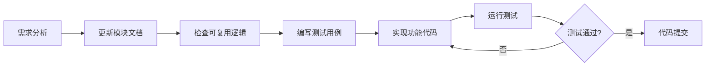

# MobausStudio Architecture / 项目架构文档

> [English](#english) | [中文](#中文)

---

<a id="english"></a>

## English

MobausStudio is a cross-platform AI client tool built with Tauri, providing multi-model chat, agent orchestration, skills extensions, and MCP server integration.

| Property | Value |
| -------- | ----- |
| Project | MobausStudio |
| Tech Stack | Tauri 2 + React 19 + TypeScript 5.8 + Rust |

---

### Core Modules

| Module | Description | Doc | Status |
| ------ | ----------- | --- | ------ |
| Chat | AI conversation | [chat.md](./chat.md) | Done |
| Agent | AI assistant management | [agent.md](./agent.md) | Done |
| AgentOrchestration | Multi-agent roundtable | [agent-orchestration.md](./agent-orchestration.md) | Done |
| Skills | Skill / prompt template system | [skills.md](./skills.md) | Done |
| MCP | External tool integration | [mcp.md](./mcp.md) | Done |
| Models | Model configuration | [models.md](./models.md) | Done |
| Providers | Provider management | [providers.md](./providers.md) | Done |
| Settings | System settings | [settings.md](./settings.md) | Done |
| Stats | Usage statistics | [stats.md](./stats.md) | Done |
| Templates | Agent template system | [templates.md](./templates.md) | Done |
| Analytics | Analytics service | [analytics.md](./analytics.md) | Done |
| Updater | Auto update | [updater.md](./updater.md) | Done |
| ConfigSwitcher | Config exporter | [config-switcher.md](./config-switcher.md) | Done |

> Note: Module docs are in Chinese. See the [中文](#中文) section below for details.

---

### Frontend Architecture

```text
src/
├── components/
│   ├── common/              # Shared components
│   │   ├── Button/
│   │   ├── Modal/
│   │   ├── Input/
│   │   ├── Toast/
│   │   ├── ContextMenu/
│   │   └── ...
│   ├── layout/              # Layout components
│   │   ├── Header/          # Top navigation
│   │   └── Sidebar/         # Side navigation
│   └── features/            # Feature modules
│       ├── Chat/            # Chat module
│       ├── Agent/           # Agent module
│       ├── AgentOrchestration/ # Roundtable module
│       ├── Skills/          # Skills module
│       ├── MCP/             # MCP module
│       ├── Models/          # Model management
│       ├── Providers/       # Provider management
│       ├── Settings/        # Settings
│       ├── Stats/           # Statistics
│       └── Templates/       # Templates
├── hooks/                   # Custom Hooks
├── services/                # Service layer (API, OAuth, etc.)
├── types/                   # TypeScript type definitions
├── utils/                   # Utility functions
├── i18n/                    # Internationalization (EN, ZH)
├── data/                    # Static data
└── test/                    # Test files
```

### Backend Architecture (Rust)

```text
src-tauri/src/
├── main.rs                  # Entry point
├── lib.rs                   # Tauri commands & core logic
├── services/                # Business logic
│   ├── config_exporter/     # Config export service
│   │   ├── mod.rs
│   │   ├── export_service.rs
│   │   ├── transformer.rs
│   │   └── writer.rs
│   └── ...
├── mcp/                     # MCP protocol module
│   ├── client.rs            # MCP client management
│   ├── protocol.rs          # MCP protocol definitions
│   ├── session.rs           # Session management
│   ├── error.rs             # Error handling
│   └── transport/           # Transport layer
│       ├── stdio.rs         # Standard I/O transport
│       └── http.rs          # HTTP transport
└── protocol/                # AI provider protocol implementations
    ├── openai.rs            # OpenAI protocol
    ├── anthropic.rs         # Anthropic protocol
    ├── google.rs            # Google AI protocol
    └── aws.rs               # AWS (Kiro) protocol
```

---

### UI Design System

| Usage | Color |
| ----- | ----- |
| Primary | `from-purple-500 to-pink-500` (gradient) |
| Agent | `from-purple-500 to-pink-500` |
| Skills | `from-blue-500 to-cyan-500` |
| MCP | `from-green-500 to-emerald-500` |
| Success | `green-500` |
| Warning | `yellow-500` |
| Error | `red-500` |

Component specs: `rounded-xl` (12px) / `rounded-2xl` (16px), `shadow-sm` / `shadow-lg`, `transition-all`, `border-2 border-gray-200`

---

---

<a id="中文"></a>

## 中文

MobausStudio 是一个基于 Tauri 框架的跨平台 AI 客户端工具，提供多模型对话、Agent 智能代理、Skills 技能扩展和 MCP 服务器集成功能。

| 属性 | 值 |
| ---- | ---- |
| 项目名称 | MobausStudio |
| 技术栈 | Tauri 2 + React 19 + TypeScript 5.8 + Rust |

---

### 核心功能模块

| 模块 | 说明 | 文档 | 状态 |
| ---- | ---- | ---- | ---- |
| Chat | AI 对话功能 | [chat.md](./chat.md) | ✅ 已完成 |
| Agent | 智能代理管理 | [agent.md](./agent.md) | ✅ 已完成 |
| AgentOrchestration | 多 Agent 圆桌对话 | [agent-orchestration.md](./agent-orchestration.md) | ✅ 已完成 |
| Skills | 技能插件系统 | [skills.md](./skills.md) | ✅ 已完成 |
| MCP | 外部服务集成 | [mcp.md](./mcp.md) | ✅ 已完成 |
| Models | 模型配置管理 | [models.md](./models.md) | ✅ 已完成 |
| Providers | 提供商管理 | [providers.md](./providers.md) | ✅ 已完成 |
| Settings | 系统设置 | [settings.md](./settings.md) | ✅ 已完成 |
| Stats | 使用统计 | [stats.md](./stats.md) | ✅ 已完成 |
| Templates | Agent 模板系统 | [templates.md](./templates.md) | ✅ 已完成 |
| Analytics | 数据分析服务 | [analytics.md](./analytics.md) | ✅ 已完成 |
| Updater | 自动更新 | [updater.md](./updater.md) | ✅ 已完成 |
| ConfigSwitcher | 配置导出器 | [config-switcher.md](./config-switcher.md) | ✅ 已完成 |

---

### 前端架构

```text
src/
├── components/
│   ├── common/              # 通用组件
│   │   ├── Button/
│   │   ├── Modal/
│   │   ├── Input/
│   │   ├── Toast/
│   │   ├── ContextMenu/
│   │   └── ...
│   ├── layout/              # 布局组件
│   │   ├── Header/          # 顶部导航
│   │   └── Sidebar/         # 侧边导航
│   └── features/            # 功能模块组件
│       ├── Chat/            # 对话模块
│       ├── Agent/           # Agent 模块
│       ├── AgentOrchestration/ # 圆桌对话模块
│       ├── Skills/          # 技能模块
│       ├── MCP/             # MCP 模块
│       ├── Models/          # 模型管理模块
│       ├── Providers/       # 提供商模块
│       ├── Settings/        # 设置模块
│       ├── Stats/           # 统计模块
│       └── Templates/       # 模板模块
├── hooks/                   # 自定义 Hooks
├── services/                # 服务层（API 调用、OAuth 等）
├── types/                   # TypeScript 类型定义
├── utils/                   # 工具函数
├── i18n/                    # 国际化（中英文）
├── data/                    # 静态数据
└── test/                    # 测试文件
```

### 后端架构（Rust）

```text
src-tauri/src/
├── main.rs                  # 主入口
├── lib.rs                   # Tauri 命令注册（包含所有命令实现）
├── services/                # 业务逻辑层
│   ├── config_exporter/     # 配置导出服务
│   │   ├── mod.rs
│   │   ├── export_service.rs
│   │   ├── transformer.rs
│   │   └── writer.rs
│   └── ...
├── mcp/                     # MCP 协议模块
│   ├── client.rs            # MCP 客户端管理
│   ├── protocol.rs          # MCP 协议定义
│   ├── session.rs           # 会话管理
│   ├── error.rs             # 错误处理
│   └── transport/           # 传输层
│       ├── stdio.rs         # 标准输入输出传输
│       └── http.rs          # HTTP 传输
└── protocol/                # AI 提供商协议模块
    ├── openai.rs            # OpenAI 协议
    ├── anthropic.rs         # Anthropic 协议
    ├── google.rs            # Google AI 协议
    └── aws.rs               # AWS（Kiro）协议
```

---

### UI 设计规范

| 用途 | 颜色 |
| ---- | ---- |
| 主色调 | `from-purple-500 to-pink-500`（渐变） |
| Agent | `from-purple-500 to-pink-500` |
| Skills | `from-blue-500 to-cyan-500` |
| MCP | `from-green-500 to-emerald-500` |
| 成功 | `green-500` |
| 警告 | `yellow-500` |
| 错误 | `red-500` |

组件规范：圆角 `rounded-xl` (12px) / `rounded-2xl` (16px)，阴影 `shadow-sm` / `shadow-lg`，过渡 `transition-all`，边框 `border-2 border-gray-200`

---

### 开发规范

> **核心原则**
> 1. **先文档后代码** -- 修改功能前必须先更新对应模块文档
> 2. **最小化修改** -- 优先复用现有逻辑，避免重复造轮子
> 3. **测试驱动** -- 每个功能必须有完善的单元测试


