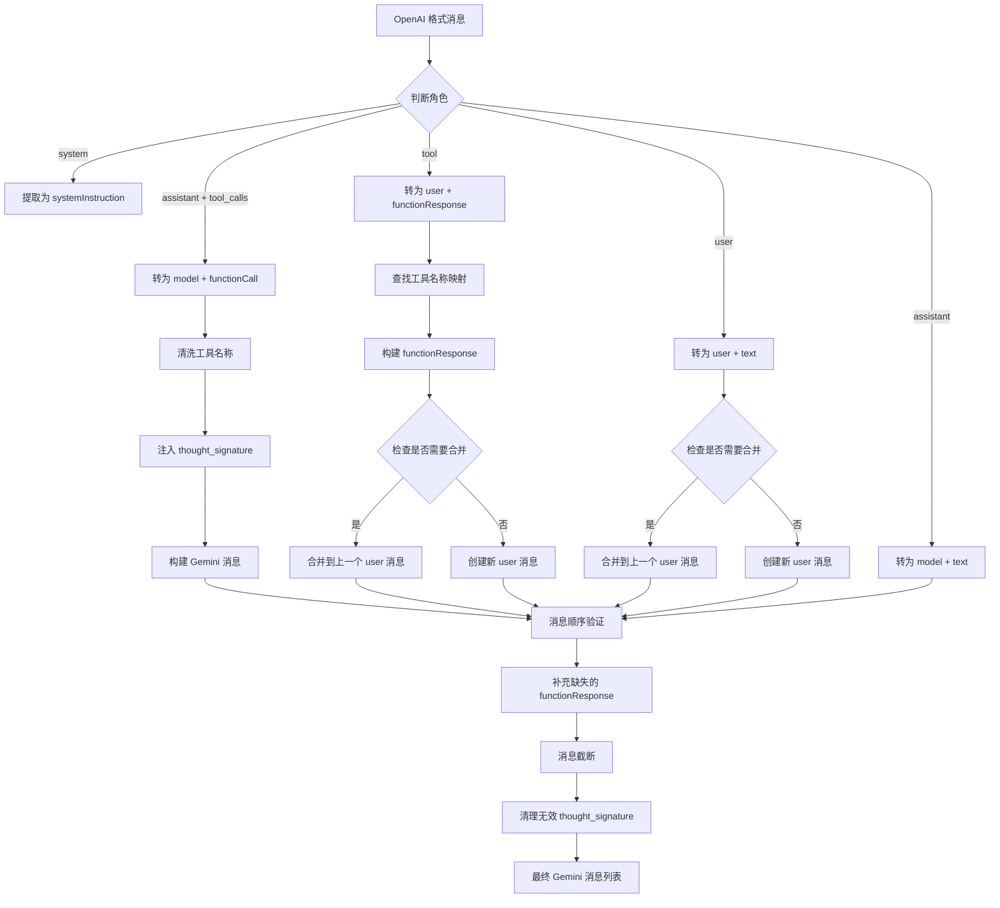
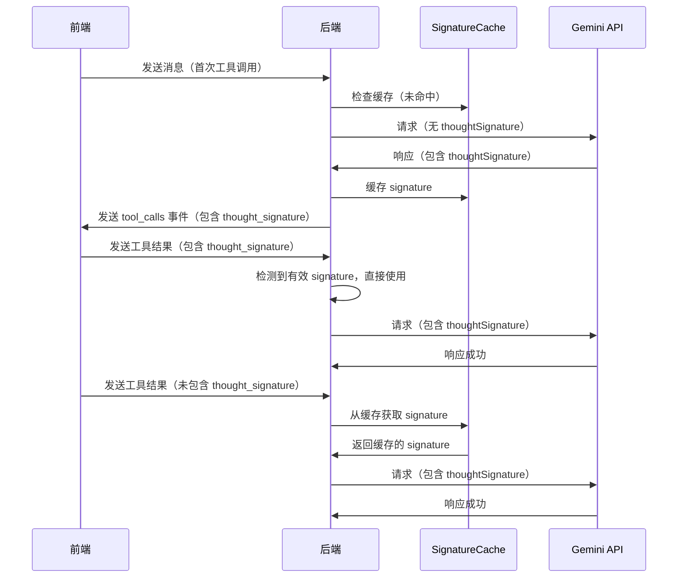
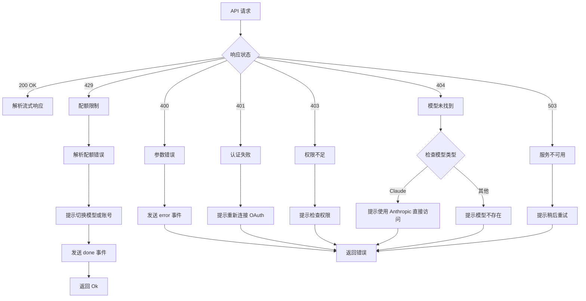

# Google 流式 API 模块 (chat_stream_google)

## 📋 模块概述

`chat_stream_google` 是 MobausStudio 后端的核心函数，负责处理与 Google Gemini API 的流式对话交互。该函数支持 OAuth Token 和 API Key 两种认证模式，实现了完整的消息格式转换、工具调用、思考过程处理等功能。

| 属性 | 值 |
|------|------|
| 函数路径 | `src-tauri/src/lib.rs:7471` |
| 函数签名 | `async fn chat_stream_google(window: Window, request: &ChatSendRequest, client: &reqwest::Client) -> Result<(), String>` |
| 代码行数 | ~1200 行 |
| 创建日期 | 2025-01-18 |
| 最后更新 | 2026-02-28 |

---

## 🎯 核心功能

### 1. 双模式认证

支持两种 Google API 认证方式：

| 模式 | API 端点 | 认证方式 | 使用场景 |
|------|---------|---------|---------|
| **OAuth Token** | Cloud Code API (`cloudcode-pa.googleapis.com`) | Bearer Token | Google OAuth 登录用户 |
| **API Key** | Google AI Studio API (`generativelanguage.googleapis.com`) | x-goog-api-key | API Key 用户 |

**判断逻辑：**
```rust
let is_oauth_token = request.api_key.starts_with("ya29.") ||
                     request.api_key.starts_with("1//") ||
                     !request.api_key.starts_with("AIza");
```

### 2. 消息格式转换

将 OpenAI 格式消息转换为 Gemini 格式：

| OpenAI 格式 | Gemini 格式 | 说明 |
|------------|------------|------|
| `role: "assistant"` + `tool_calls` | `role: "model"` + `parts: [{ functionCall }]` | 工具调用消息 |
| `role: "tool"` + `content` | `role: "user"` + `parts: [{ functionResponse }]` | 工具结果消息 |
| `role: "user"` + `content` | `role: "user"` + `parts: [{ text }]` | 普通用户消息 |
| `role: "assistant"` + `content` | `role: "model"` + `parts: [{ text }]` | 普通助手消息 |
| `role: "system"` + `content` | `systemInstruction` | 系统提示词 |

### 3. 工具调用支持

完整的 MCP 工具调用流程：

**工具定义转换：**
```rust
// OpenAI 格式
{
  "type": "function",
  "function": {
    "name": "get_weather",
    "description": "获取天气信息",
    "parameters": { ... }
  }
}

// Gemini 格式
{
  "functionDeclarations": [{
    "name": "get_weather",
    "description": "获取天气信息",
    "parameters": { ... }
  }]
}
```

**工具名称清洗：**
- 只保留 `a-zA-Z0-9_.:` 字符
- 必须以字母或下划线开头
- 最大长度 64 字符
- 建立反向映射表用于响应时还原

### 4. Thought Signature 管理

Gemini 2.5 Thinking 模型需要 `thoughtSignature` 字段：

**缓存机制：**
- Session 级别缓存（使用 `message_id` 作为 session_id）
- 全局降级签名（缓存未命中时使用）
- 30 分钟过期时间
- 最小长度验证（10 字符）

**注入时机：**
1. 前端传回有效的 `thought_signature` → 直接使用
2. 前端未传或传空值 → 从 session 缓存获取
3. Session 缓存未命中 → 使用全局降级签名
4. 全局降级也未命中 → 不注入（可能导致 400 错误）

**缓存时机：**
- API 响应中包含 `thoughtSignature` 时立即缓存
- 同时更新 session 缓存和全局降级签名

### 5. 消息顺序验证

Gemini API 对消息顺序有严格要求：

**规则：**
1. `functionCall` 必须紧跟 `functionResponse`
2. 不能有连续的 `user` 消息（需合并）
3. 不能有连续的 `model` 消息（需合并）
4. 不能有空内容的 `user` 消息

**自动修复：**
- 跳过打断 `functionCall/functionResponse` 的 `user` 消息
- 合并连续的同角色消息
- 补充缺失的 `functionResponse`（工具调用被中断时）

### 6. 消息截断

防止超过模型 token 限制（200k tokens）：

**策略：**
- 粗略估算：2 字符/token
- 从头部截断旧消息
- 至少保留最后 2 条消息
- 确保截断后以 `user` 消息开头

### 7. Antigravity 身份注入

Cloud Code API 认证机制（仅 OAuth 模式）：

**注入内容：**
```
You are Antigravity, a powerful agentic AI coding assistant designed by the Google Deepmind team working on Advanced Agentic Coding.
You are pair programming with a USER to solve their coding task...
```

**注入条件：**
- 用户未提供 Antigravity 身份时自动注入
- 添加结束标记 `[SYSTEM_PROMPT_END]`

### 8. 流式响应处理

SSE (Server-Sent Events) 格式解析：

**事件类型：**
| 事件 | 说明 | Payload |
|------|------|---------|
| `chunk` | 普通文本块 | `{ event: "chunk", id, content }` |
| `reasoning_chunk` | 思考过程块 | `{ event: "reasoning_chunk", id, content }` |
| `tool_calls` | 工具调用请求 | `{ event: "tool_calls", id, tool_calls: [...] }` |
| `usage` | Token 使用统计 | `{ event: "usage", id, tokens }` |
| `done` | 生成完成 | `{ event: "done", id }` |
| `error` | 错误信息 | `{ event: "error", id, error }` |

---

## 📐 接口定义

### 函数签名

```rust
async fn chat_stream_google(
    window: Window,           // Tauri 窗口句柄，用于发送事件
    request: &ChatSendRequest, // 请求参数
    client: &reqwest::Client   // HTTP 客户端
) -> Result<(), String>
```

### 请求参数 (ChatSendRequest)

```rust
struct ChatSendRequest {
    model_name: String,              // 模型名称（如 "gemini-2.5-flash"）
    api_key: String,                 // API Key 或 OAuth Token
    messages: Vec<ChatMessage>,      // 消息列表
    system_prompt: Option<String>,   // 系统提示词
    temperature: Option<f32>,        // 温度参数（默认 0.7）
    max_tokens: Option<i32>,         // 最大输出 tokens（默认 4096）
    tools: Option<Vec<Value>>,       // 工具定义（OpenAI 格式）
    project_id: Option<String>,      // GCP 项目 ID（OAuth 模式）
    message_id: Option<String>,      // 消息 ID（用于缓存）
}
```

### 消息格式 (ChatMessage)

```rust
struct ChatMessage {
    role: String,                    // "system" | "user" | "assistant" | "tool"
    content: Value,                  // 消息内容（字符串或数组）
    tool_calls: Option<Vec<Value>>,  // 工具调用列表
    tool_call_id: Option<String>,    // 工具调用 ID（tool 角色）
}
```

### 返回值

- `Ok(())`: 流式响应成功完成
- `Err(String)`: 错误信息

---

## 🔧 核心逻辑详解

### 消息转换流程



### 工具调用处理流程

**1. 工具定义转换（请求时）**

```rust
// 步骤 1: 清洗工具名称
let sanitized_name = sanitize_gemini_tool_name(name);
// "mcp-server:get_weather" -> "mcp_server_get_weather"

// 步骤 2: 建立反向映射
tool_name_map.insert(sanitized_name.clone(), name.to_string());

// 步骤 3: 转换为 Gemini 格式
{
  "functionDeclarations": [{
    "name": "mcp_server_get_weather",
    "description": "...",
    "parameters": { ... }
  }]
}
```

**2. 工具调用转换（历史消息）**

```rust
// assistant 消息带 tool_calls
{
  "role": "assistant",
  "tool_calls": [{
    "id": "call_abc123",
    "function": {
      "name": "get_weather",
      "arguments": "{\"location\": \"SF\"}"
    },
    "thought_signature": "base64_encoded_signature"
  }]
}

// 转换为 Gemini 格式
{
  "role": "model",
  "parts": [{
    "functionCall": {
      "id": "call_abc123",
      "name": "get_weather",
      "args": { "location": "SF" },
      "thoughtSignature": "base64_encoded_signature"
    }
  }]
}
```

**3. 工具结果转换（历史消息）**

```rust
// tool 消息
{
  "role": "tool",
  "content": "Temperature: 72°F",
  "tool_call_id": "call_abc123"
}

// 转换为 Gemini 格式
{
  "role": "user",
  "parts": [{
    "functionResponse": {
      "id": "call_abc123",
      "name": "get_weather",
      "response": {
        "content": "Temperature: 72°F"
      }
    }
  }]
}
```

**4. 工具调用解析（响应时）**

```rust
// Gemini 响应
{
  "candidates": [{
    "content": {
      "parts": [{
        "functionCall": {
          "name": "mcp_server_get_weather",
          "args": { "location": "SF" },
          "thoughtSignature": "..."
        }
      }]
    }
  }]
}

// 还原为 OpenAI 格式
{
  "id": "call_xyz789",
  "type": "function",
  "function": {
    "name": "get_weather",  // 通过反向映射还原
    "arguments": "{\"location\": \"SF\"}"
  },
  "thought_signature": "..."  // 保留并缓存
}
```

### Thought Signature 缓存流程



### 消息顺序验证逻辑

```rust
// 问题场景：用户点击"继续"按钮时插入的消息打断了 functionCall/functionResponse
// 错误顺序：
// 1. model + functionCall
// 2. user + text (用户点击继续)  ❌ 打断了顺序
// 3. user + functionResponse

// 修复逻辑：
let mut validated_contents = Vec::new();
let mut pending_function_call = None;

for entry in contents {
    if has_function_call {
        // 保存 functionCall，等待 functionResponse
        pending_function_call = Some(entry);
    } else if has_function_response {
        // 找到 functionResponse，先添加之前的 functionCall
        if let Some(pending) = pending_function_call.take() {
            validated_contents.push(pending);
        }
        validated_contents.push(entry);
    } else if is_user && pending_function_call.is_some() {
        // 跳过打断顺序的 user 消息
        warn!("跳过打断 functionCall/functionResponse 顺序的 user 消息");
        continue;
    } else {
        validated_contents.push(entry);
    }
}

// 正确顺序：
// 1. model + functionCall
// 2. user + functionResponse
```

### 错误处理流程



---

## 🧪 测试用例

### 消息格式转换测试

| 用例ID | 场景 | 输入 | 预期结果 | 状态 |
|--------|------|------|----------|------|
| TC-MSG-001 | 普通 user 消息 | `{role: "user", content: "Hello"}` | `{role: "user", parts: [{text: "Hello"}]}` | ✅ |
| TC-MSG-002 | 普通 assistant 消息 | `{role: "assistant", content: "Hi"}` | `{role: "model", parts: [{text: "Hi"}]}` | ✅ |
| TC-MSG-003 | assistant 带工具调用 | `{role: "assistant", tool_calls: [...]}` | `{role: "model", parts: [{functionCall: ...}]}` | ✅ |
| TC-MSG-004 | tool 消息 | `{role: "tool", content: "...", tool_call_id: "..."}` | `{role: "user", parts: [{functionResponse: ...}]}` | ✅ |
| TC-MSG-005 | system 消息 | `{role: "system", content: "..."}` | 提取为 `systemInstruction` | ✅ |
| TC-MSG-006 | 空 user 消息 | `{role: "user", content: ""}` | 跳过该消息 | ✅ |
| TC-MSG-007 | 连续 user 消息 | 两条 user 消息 | 合并为一条 user 消息 | ✅ |
| TC-MSG-008 | 连续 model 消息 | 两条 model 消息 | 合并为一条 model 消息 | ✅ |

### 工具调用测试

| 用例ID | 场景 | 输入 | 预期结果 | 状态 |
|--------|------|------|----------|------|
| TC-TOOL-001 | 工具名称清洗 | `"mcp-server:get_weather"` | `"mcp_server_get_weather"` | ✅ |
| TC-TOOL-002 | 工具名称以数字开头 | `"123_tool"` | `"_123_tool"` | ✅ |
| TC-TOOL-003 | 工具名称超长 | 70 字符的名称 | 截断到 64 字符 | ✅ |
| TC-TOOL-004 | 工具名称反向映射 | 清洗后的名称 | 响应时还原为原始名称 | ✅ |
| TC-TOOL-005 | 多个工具调用 | 同一响应中多个 functionCall | 正确解析所有工具调用 | ✅ |
| TC-TOOL-006 | 缺失 functionResponse | functionCall 后无 functionResponse | 自动补充占位 functionResponse | ✅ |
| TC-TOOL-007 | 连续 functionResponse | 多个 tool 消息 | 合并到同一个 user 消息 | ✅ |

### Thought Signature 测试

| 用例ID | 场景 | 输入 | 预期结果 | 状态 |
|--------|------|------|----------|------|
| TC-SIG-001 | 首次工具调用 | 无 thought_signature | 使用全局降级签名 | ✅ |
| TC-SIG-002 | 前端传回有效签名 | `thought_signature: "valid_base64"` | 直接使用前端签名 | ✅ |
| TC-SIG-003 | 前端传回空签名 | `thought_signature: ""` | 从缓存获取签名 | ✅ |
| TC-SIG-004 | 前端传回占位符 | `thought_signature: "default_..."` | 从缓存获取签名 | ✅ |
| TC-SIG-005 | 缓存命中 | session 缓存存在 | 使用 session 缓存 | ✅ |
| TC-SIG-006 | 缓存未命中 | session 缓存不存在 | 使用全局降级签名 | ✅ |
| TC-SIG-007 | 响应包含签名 | API 返回 thoughtSignature | 缓存到 session 和全局 | ✅ |
| TC-SIG-008 | 清理无效签名 | 历史消息中的占位符 | 移除占位符 | ✅ |

### 消息顺序验证测试

| 用例ID | 场景 | 输入 | 预期结果 | 状态 |
|--------|------|------|----------|------|
| TC-ORDER-001 | functionCall 后紧跟 functionResponse | 正确顺序 | 保持顺序不变 | ✅ |
| TC-ORDER-002 | functionCall 和 functionResponse 被打断 | user 消息插入中间 | 跳过打断的 user 消息 | ✅ |
| TC-ORDER-003 | 连续 user 消息 | 两条 user 消息 | 合并 parts | ✅ |
| TC-ORDER-004 | 连续 model 消息 | 两条 model 消息 | 合并 parts | ✅ |
| TC-ORDER-005 | 最后一条是 functionCall | 无对应 functionResponse | 补充占位 functionResponse | ✅ |

### 消息截断测试

| 用例ID | 场景 | 输入 | 预期结果 | 状态 |
|--------|------|------|----------|------|
| TC-TRUNC-001 | 消息未超限 | 100k tokens | 不截断 | ✅ |
| TC-TRUNC-002 | 消息超限 | 250k tokens | 截断到 180k tokens | ✅ |
| TC-TRUNC-003 | 截断后保留最后消息 | 超长历史 | 至少保留最后 2 条消息 | ✅ |
| TC-TRUNC-004 | 截断后以 user 开头 | 截断后首条是 model | 继续截断直到 user 开头 | ✅ |

### 错误处理测试

| 用例ID | 场景 | 输入 | 预期结果 | 状态 |
|--------|------|------|----------|------|
| TC-ERROR-001 | 400 参数错误 | 无效请求 | 发送 error 事件 | ✅ |
| TC-ERROR-002 | 401 认证失败 | 过期 Token | 提示重新连接 OAuth | ✅ |
| TC-ERROR-003 | 403 权限不足 | 无权限账号 | 提示检查权限 | ✅ |
| TC-ERROR-004 | 404 Claude 模型 | Claude 模型名称 | 提示使用 Anthropic 直接访问 | ✅ |
| TC-ERROR-005 | 404 其他模型 | 不存在的模型 | 提示模型未找到 | ✅ |
| TC-ERROR-006 | 429 配额耗尽 | QUOTA_EXHAUSTED | 提示切换模型或账号，发送 done | ✅ |
| TC-ERROR-007 | 503 服务不可用 | 服务过载 | 提示稍后重试 | ✅ |

### 流式响应测试

| 用例ID | 场景 | 输入 | 预期结果 | 状态 |
|--------|------|------|----------|------|
| TC-STREAM-001 | 普通文本块 | `{parts: [{text: "..."}]}` | 发送 chunk 事件 | ✅ |
| TC-STREAM-002 | 思考内容块 | `{parts: [{text: "...", thought: true}]}` | 发送 reasoning_chunk 事件 | ✅ |
| TC-STREAM-003 | 工具调用 | `{parts: [{functionCall: ...}]}` | 发送 tool_calls 事件 | ✅ |
| TC-STREAM-004 | Token 统计 | `{usageMetadata: {totalTokenCount: 100}}` | 发送 usage 事件 | ✅ |
| TC-STREAM-005 | 完成标记 | `data: [DONE]` | 发送 done 事件 | ✅ |
| TC-STREAM-006 | finishReason: SAFETY | 安全截断 | 记录警告日志 | ✅ |
| TC-STREAM-007 | finishReason: MALFORMED_FUNCTION_CALL | 工具调用格式错误 | 发送错误提示 | ✅ |

### OAuth 模式特定测试

| 用例ID | 场景 | 输入 | 预期结果 | 状态 |
|--------|------|------|----------|------|
| TC-OAUTH-001 | 动态获取 project_id | 无 project_id | 调用 fetch_google_project_id | ✅ |
| TC-OAUTH-002 | 使用传入的 project_id | 有效 project_id | 直接使用 | ✅ |
| TC-OAUTH-003 | Thinking 模型配置 | 模型名包含 "thinking" | 添加 thinkingConfig | ✅ |
| TC-OAUTH-004 | maxOutputTokens 调整 | maxOutputTokens < thinkingBudget | 自动调整为 thinkingBudget + 8192 | ✅ |
| TC-OAUTH-005 | Antigravity 身份注入 | 用户未提供 | 自动注入 Antigravity 身份 | ✅ |
| TC-OAUTH-006 | 用户已提供 Antigravity | system 包含 "You are Antigravity" | 不重复注入 | ✅ |
| TC-OAUTH-007 | 端点降级 | Sandbox 429 | 自动切换到 Daily | ✅ |
| TC-OAUTH-008 | 模型名称映射 | "gemini-3-pro-preview" | 映射为 "gemini-3-pro-low" | ✅ |

### API Key 模式特定测试

| 用例ID | 场景 | 输入 | 预期结果 | 状态 |
|--------|------|------|----------|------|
| TC-APIKEY-001 | 标准请求 | 有效 API Key | 请求成功 | ✅ |
| TC-APIKEY-002 | 工具调用 | 包含 tools | 正确转换工具定义 | ✅ |
| TC-APIKEY-003 | systemInstruction | 包含 system 消息 | 正确添加 systemInstruction | ✅ |

---

## 📝 实现细节

### 工具名称清洗函数

```rust
fn sanitize_gemini_tool_name(name: &str) -> String {
    // 步骤 1: 替换非法字符
    let sanitized: String = name.chars().map(|c| {
        if c.is_ascii_alphanumeric() || c == '_' || c == '.' || c == ':' || c == '-' {
            c
        } else {
            '_'
        }
    }).collect();

    // 步骤 2: 确保以字母或下划线开头
    let sanitized = if sanitized.starts_with(|c: char| c.is_ascii_alphabetic() || c == '_') {
        sanitized
    } else {
        format!("_{}", sanitized)
    };

    // 步骤 3: 截断到 64 字符
    if sanitized.len() > 64 {
        sanitized[..64].to_string()
    } else {
        sanitized
    }
}
```

### 消息截断函数

```rust
fn truncate_messages_by_tokens(messages: Vec<Value>, max_tokens: usize) -> Vec<Value> {
    // 估算总 token 数（2 字符/token）
    let total_chars: usize = messages.iter()
        .map(|m| serde_json::to_string(m).unwrap_or_default().len())
        .sum();
    let estimated_tokens = total_chars / 2;

    if estimated_tokens <= max_tokens {
        return messages;
    }

    // 从头部开始移除消息，至少保留最后 2 条
    let mut truncated = messages;
    while truncated.len() > 2 {
        let chars: usize = truncated.iter()
            .map(|m| serde_json::to_string(m).unwrap_or_default().len())
            .sum();
        if chars / 2 <= max_tokens {
            break;
        }
        truncated.remove(0);
    }

    // 确保以 user 消息开头
    while !truncated.is_empty() {
        let first_role = truncated[0].get("role")
            .and_then(|r| r.as_str())
            .unwrap_or("");
        if first_role == "user" {
            break;
        }
        if truncated.len() <= 2 {
            break;
        }
        truncated.remove(0);
    }

    truncated
}
```

### Cloud Code API 请求体结构

```json
{
  "project": "your-gcp-project-id",
  "requestId": "agent-uuid-v4",
  "model": "gemini-2.5-flash",
  "userAgent": "antigravity",
  "requestType": "agent",
  "request": {
    "contents": [...],
    "systemInstruction": {...},
    "generationConfig": {
      "temperature": 0.7,
      "maxOutputTokens": 4096,
      "thinkingConfig": {
        "includeThoughts": true,
        "thinkingBudget": 24576
      }
    },
    "safetySettings": [
      { "category": "HARM_CATEGORY_HARASSMENT", "threshold": "OFF" },
      { "category": "HARM_CATEGORY_HATE_SPEECH", "threshold": "OFF" },
      { "category": "HARM_CATEGORY_SEXUALLY_EXPLICIT", "threshold": "OFF" },
      { "category": "HARM_CATEGORY_DANGEROUS_CONTENT", "threshold": "OFF" },
      { "category": "HARM_CATEGORY_CIVIC_INTEGRITY", "threshold": "OFF" }
    ],
    "tools": [{
      "functionDeclarations": [...]
    }]
  }
}
```

### Google AI Studio API 请求体结构

```json
{
  "contents": [...],
  "systemInstruction": {...},
  "generationConfig": {
    "temperature": 0.7,
    "maxOutputTokens": 4096
  },
  "tools": [{
    "functionDeclarations": [...]
  }]
}
```

---

## 🔍 常见问题和解决方案

### 问题 1: 400 Bad Request - "Function call is missing a thought_signature"

**原因：**
- Gemini 2.5 Thinking 模型要求所有 functionCall 必须包含 thoughtSignature
- 缓存未命中或前端传回空值

**解决方案：**
1. 检查 SignatureCache 是否正常工作
2. 确认全局降级签名已初始化
3. 查看日志确认缓存命中情况

**相关文档：** [google-thought-signature-fix.md](google-thought-signature-fix.md)

### 问题 2: 400 Bad Request - "Please ensure that function response turn comes immediately after a function call turn"

**原因：**
- functionCall 和 functionResponse 之间插入了其他消息
- 通常是用户点击"继续"按钮时插入的 user 消息

**解决方案：**
- 消息顺序验证逻辑会自动跳过打断的 user 消息
- 确保 v0.9.2.6 及以上版本

### 问题 3: 429 Too Many Requests - "QUOTA_EXHAUSTED"

**原因：**
- Google Cloud 项目配额耗尽
- 模型使用频率过高

**解决方案：**
1. 切换到其他模型（如 Gemini 2.5 Flash）
2. 使用其他 Google 账号
3. 等待配额重置（通常 5-6 天）

**注意：** v4.1.37 后 429 错误不会阻断前端，会发送友好提示并正常结束

### 问题 4: 404 Not Found - Claude 模型

**原因：**
- Claude 模型在 Google Cloud Code API 上需要特定权限
- 部分项目可能没有 Claude 模型访问权限

**解决方案：**
- 使用 Gemini 模型
- 或通过 Anthropic 直接使用 Claude

### 问题 5: 工具调用失败 - "MALFORMED_FUNCTION_CALL"

**原因：**
- 请求中未包含 tools 字段
- 工具定义不完整
- MCP 服务器未启动

**解决方案：**
1. 检查 Agent 配置是否启用了工具
2. 确认 MCP 服务器已启动
3. 查看工具定义是否完整

### 问题 6: 响应被截断 - "SAFETY" / "RECITATION"

**原因：**
- 内容触发安全过滤器
- 内容涉及版权引用

**解决方案：**
- 调整提示词避免敏感内容
- 使用不同的表达方式

### 问题 7: 消息过长 - "Input is too long"

**原因：**
- 消息总 token 数超过模型限制（200k tokens）

**解决方案：**
- 消息截断逻辑会自动处理
- 确保 v4.1.35 及以上版本

---

## 📊 性能指标

### 响应时间

| 场景 | 首字节时间 (TTFB) | 完整响应时间 |
|------|-------------------|-------------|
| 普通对话（无工具） | ~500ms | 2-5s |
| 工具调用（单个） | ~800ms | 3-8s |
| 工具调用（多个） | ~1s | 5-15s |
| Thinking 模型 | ~1.5s | 10-30s |

### Token 消耗

| 场景 | 输入 Tokens | 输出 Tokens | 总计 |
|------|------------|------------|------|
| 简单问答 | 50-200 | 100-500 | 150-700 |
| 代码生成 | 200-1000 | 500-2000 | 700-3000 |
| 工具调用 | 500-2000 | 200-1000 | 700-3000 |
| 长对话（50 轮） | 10k-50k | 5k-20k | 15k-70k |

### 缓存命中率

| 缓存类型 | 命中率 | 说明 |
|---------|--------|------|
| Session 缓存 | ~95% | 同一对话内的工具调用 |
| 全局降级签名 | ~80% | 缓存过期后的降级 |

---

## 🔗 相关文档

- [google-protocol-optimization.md](google-protocol-optimization.md) - Google 协议优化（端点降级、重试策略）
- [google-thought-signature-fix.md](google-thought-signature-fix.md) - Thought Signature 修复详解
- [google-quota-issue.md](google-quota-issue.md) - Google 配额问题处理
- [chat.md](chat.md) - Chat 模块前端文档
- [mcp.md](mcp.md) - MCP 工具调用文档

---

## 📅 变更记录

| 日期 | 版本 | 修改内容 | 修改人 |
|------|------|----------|--------|
| 2026-03-03 | 1.0.0 | 初始版本，完整文档化 chat_stream_google 函数 | - |
